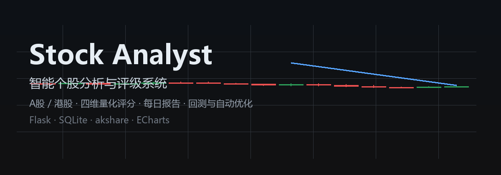

# Stock Analyst — 智能个股分析与评级系统




面向 **A 股（及港股）**个人投资者的本地价值投资分析工具。零代码、一键启动、浏览器即用，数据全部保存在你自己的电脑上。

## 它能做什么

| 场景 | 能力 |
|------|------|
| 📋 自选股管理 | 50 只上限、分组管理、A股/港股混合、持仓与交易流水登记 |
| 📊 数据采集 | K线/基本面/资金面/消息面 + 业绩预告快报 + 股东结构，多数据源容错、自动降级与补采 |
| 🎯 四维评分（v5 引擎） | 技术面(月线方向+周线波段+日线择时) / 基本面(估值/盈利/成长/现金流/财务健康) / 资金面(主力/机构/杠杆/股东人数) / 消息面，0-100 分 → 五档评级 |
| 💡 建议生成 | 中文投资建议、风险提示、评级变更追踪、ATR 动态网格价位与止盈止损 |
| 📰 每日报告 | 一键生成，Markdown + Excel 导出 |
| 🧪 回测中心 | 评级有效性（T+1/T+5/T+20）、价格建议命中率（真实样本主口径，无未来函数）、技术面专项历史回测 |
| ⚡ 自动优化 | 基于回测准确率的规则化权重/阈值自动调参（带安全阀回滚） |
| 🔔 智能预警 | 评级跨档、评分跌破阈值、主力资金连续净流出 |
| 🩺 服务自愈 | Windows 计划任务看门狗，服务中断 1 分钟内自动拉起 |

## 快速开始（Windows）

```bash
# 1. 安装依赖（Python 3.12+）
pip install -r requirements.txt

# 2. 一键启动（自动依赖检查 / 端口释放 / 健康检查）
start.bat
# 或直接运行
python app.py
```

启动后浏览器访问 **http://127.0.0.1:5000**

> 详细操作见 [用户使用说明.md](用户使用说明.md)

## 评分体系（v5 引擎）

四个维度独立评分后按可配置权重合成总分，映射为五档评级（≥80 强烈推荐买入 / ≥65 推荐买入 / ≥50 持有观望 / ≥30 建议减仓 / <30 强烈建议卖出）：

- **技术面（多周期）**：月线方向 25% + 周线波段 45%（趋势/超买超卖/波动）+ 日线择时 30%，月线空头时总分 ×0.85
- **基本面**：估值 / 盈利能力 / 成长性（**业绩预告/快报按置信度折价融合**）/ 现金流 / 财务健康
- **资金面**：主力资金 / 机构持仓 / 杠杆资金 / 股东人数（北向资金因政策断供已移除；港股另有南向资金展示）
- **消息面**：新闻情绪 + 股东增减持

字段缺失时维度内自动降级调权，绝不静默编造数据；数据完整度与降级原因全程透明展示。

## 回测中心（诚实的验证）

- **评级回测**：T+1/T+5/T+20 方向命中率、评级有效期动态准确率，按**引擎版本分层**统计（新规则需自然积累样本后才具统计意义）
- **价格回测**：买入区间/目标价/止损价命中率，**主口径为真实评级回测点（无未来函数）**，历史重建点仅作参照
- **技术面专项**：`python scripts/run_technical_backtest.py` 按历史时点重算当前技术规则，输出 T+5/T+20 命中率报告

## 技术栈

| 类别 | 技术 |
|------|------|
| 语言 | Python 3.12+ |
| Web | Flask（单进程，本地 127.0.0.1:5000） |
| 数据源 | akshare + 腾讯自选股(westock) + 通达信 mootdx 备份 |
| 存储 | SQLite（WAL 模式，单文件） |
| 校验/处理 | pydantic v2 / pandas / numpy |
| 导出 | openpyxl（Excel） |

## 数据源说明

| 数据 | 主源 → 备源 |
|------|------------|
| K线 | 腾讯财经 → 通达信 mootdx（前复权，最长 800 根日线） |
| 基本面 | 新浪财经抽象财报 + 腾讯估值（PE/PB） |
| 资金面 | 东方财富 → 腾讯自选股(westock) → 新浪主力口径（多级自动降级） |
| 业绩预告/快报 | 东方财富（预告按置信度 0.6/0.8、快报 0.9 折价入分） |
| 股东人数/机构持仓 | 东方财富 |
| 南向资金（港股） | 东方财富（仅展示，不参评） |
| 新闻 | 东方财富 |

- 东财请求内置风控：熔断冷却、push2 编号子域轮换、全局最小请求间隔
- **北向资金自 2024-08-16 起政策性停更**，相关评分因子已移除；港股数据源稳定性弱于 A 股，缺失时引擎自动降级

## 验证与治理

```bash
python -m pytest tests/            # 单元/冒烟测试（隔离临时库，不触网）
python scripts/check_redlines.py   # 红线自动核验
ruff check .
mypy app.py config.py modules
```

项目内置**红线治理**（[docs/RED_LINES.md](docs/RED_LINES.md)）：评分引擎核心、数据契约、建议生成等关键对象受保护，任何改动须登记豁免；风控阈值、数据库不变量由自动化脚本看护。

## 目录结构

```
stock_analyst/
├── app.py              # Flask 入口
├── config.py           # 全局配置（采集参数/评分权重/风控阈值）
├── config_weights.json # 评分权重（热加载，无需重启）
├── blueprints/         # API 路由（9 个业务域蓝图）
├── modules/            # 业务模块（采集/评分/建议/回测/预警/优化）
├── database/           # SQLite 管理（建表/迁移/备份）
├── static/ templates/  # 前端（原生 JS + ECharts）
├── scripts/            # 运维脚本（托盘/服务安装/看门狗/技术面回测）
├── docs/               # 项目文档（需求/验收/评审/知识库）
└── tests/              # pytest（隔离临时库，不触网）
```

## 免责声明

本项目仅用于量化分析方法的研究与学习，所有评分、评级与建议均由程序自动生成，**不构成任何投资建议**。股市有风险，投资需谨慎。

## License

[MIT](LICENSE)
