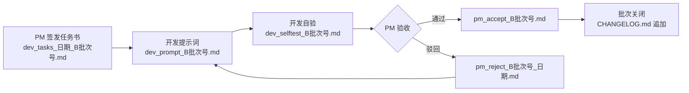

# Stock Analyst 项目目录结构与命名规范说明书

> **目标读者**：新加入项目的协作者（PM / 开发 / 监理）
> **用途**：快速定位"某类文件应该放哪里、叫什么名字"
> **版本**：v1.0（2026-07-26 监理签发）

---

## 一、项目结构总览（10 个目录）

| # | 目录/文件 | 用途 | 典型文件 | 命名规则 |
|---|---|---|---|---|
| 1 | 根目录 `/` | 启动入口 + 全局配置 + 主数据库 | `app.py`, `config.py`, `start.bat` | 固定名称 |
| 2 | `database/` | 数据库连接层 + 数据库副本 | `db_manager.py`, `stock_analyst.db` | `db_manager.py` 固定名 |
| 3 | `modules/` | 17 个核心业务模块（v5 引擎 + legacy） | `scoring_engine.py`, `advisor.py` | `<功能名>.py`（snake_case） |
| 4 | `templates/` | 前端单页应用（含 HTML/JS/CSS） | `index.html` | 固定名称 |
| 5 | `scripts/` | 运维 / 回填 / 校准脚本 | `b26_margin_backfill.py` | `b<批次号>_<主题>.py` 或主题名 |
| 6 | `docs/` | 文档层（需求 / 任务书 / 评审 / 角色 / 知识库） | `requirements_v1.1.md`, `PROJECT_INDEX.md` | 见第三节 |
| 7 | `reports/` | 报告层（每日报告 + 自验 + 验收 + UX 截图） | `2026-07-26.md`, `pm_accept_B26.md` | 见第三节 |
| 8 | `screenshots/` | 功能截图与 UX 证据图 | `01_hengrui.png`, `report_full.png` | `<序号>_<主题>.png` 或 `<主题>_<描述>.png` |
| 9 | `logs/` | 长期保留的运行/审计日志 | `rollback_audit.log` | `<功能>.log` |
| 10 | `__pycache__/` | Python 自动生成字节码缓存（**可安全删除**） | — | 自动生成 |

---

## 二、根目录文件清单

| 文件 | 类型 | 说明 |
|---|---|---|
| `app.py` | 入口 | Flask 主应用，路由 + 启动入口 |
| `config.py` | 配置 | 全局常量（端口 / 路径 / 开关） |
| `config_engine_switch.json` | 配置 | v5 引擎灰度切换白名单 |
| `config_weights.json` | 配置 | 四维权重 + 评级映射 + 行业覆盖 |
| `requirements.txt` | 依赖 | pip 依赖清单 |
| `start.bat` / `start.sh` | 启动脚本 | Windows / Linux+Mac 一键启动 |
| `stock_analyst.db` | **主库** | SQLite 数据库（**主库，与 `database/` 副本同步**） |
| `CHANGELOG.md` | 变更日志 | 按日期记录所有批次变更（**根目录为唯一副本**） |
| `用户使用说明.md` | 用户手册 | 面向零代码用户的操作手册（B25 更新，587 行） |
| `test_engine_compare.py` | 测试 | v5 / legacy 引擎对比测试 |
| `test_us11_consistency.py` | 测试 | US-11 列表与报告一致性测试 |
| `_p0_ths_stress_result.json` | 历史数据 | 同花顺接口压力测试结果（P0 阶段，存档） |
| `$null` | ⚠️ 垃圾文件 | PowerShell 重定向误操作产物，**待清理** |
| `=` | ⚠️ 垃圾文件 | 同上，**待清理** |

---

## 三、文件命名规则

### 3.1 任务书与提示词（`docs/tasks/`）

| 文件类型 | 命名 pattern | 实际示例 |
|---|---|---|
| **开发任务书** | `dev_tasks_<日期>_B<批次号>.md` | `dev_tasks_20260726_B26.md` |
| 开发提示词 | `dev_prompt_B<批次号>[_hotfix][_qwen].md` | `dev_prompt_B26.md`、`dev_prompt_B18_hotfix.md`、`dev_prompt_B6_qwen.md` |
| PM 提示词 | `pm_prompt_latest.md`（固定名） | `pm_prompt_latest.md` |
| PM 裁决记录 | `pm_ruling_<日期>.md` | `pm_ruling_20260722.md` |
| PM 验收报告 | `pm_accept_B<批次号>[_日期].md` | `pm_accept_B21.md`、`pm_accept_B23_B24_B25.md` |
| PM 驳回报告 | `pm_reject_B<批次号>_<日期>.md` | `pm_reject_B18_hotfix_20260725.md` |
| QA 任务 | `qa_task_<日期>.md` | `qa_task_20260722.md` |
| QA 验收 | `qa_accept_<日期>.md` | `qa_accept_20260722.md` |
| 架构师任务 | `architect_task_<日期>.md` | `architect_task_20260722.md` |
| 测试提示词 | `test_prompt_<主题>.md` | `test_prompt_data_quality.md` |

> ⚠️ **命名演进**：早期 `dev_tasks_20260722.md`（无批次号）和 `dev_tasks_20260722_B2.md`（下划线日期）共存；自 B12 起统一为 `dev_tasks_2026-07-25_B12.md`（横线日期 + 批次号），**新任务书必须采用第三种格式**。

### 3.2 报告层（`reports/`）

| 文件类型 | 命名 pattern | 实际示例 |
|---|---|---|
| **每日报告** | `YYYY-MM-DD.md` | `2026-07-26.md` |
| 开发自验 | `dev_selftest_B<批次号>[_hotfix].md` | `dev_selftest_B22.md`、`dev_selftest_B18_hotfix.md` |
| 开发验证 | `dev_verify_B<批次号>_<日期>.md` | `dev_verify_B2_20260722.md` |
| PM 验收 | `pm_accept_B<批次号>[_日期].md` | `pm_accept_B20.md`、`pm_accept_20260722.md` |
| PM 驳回 | `pm_reject_B<批次号>_<日期>.md` | `pm_reject_B18_hotfix_20260725.md` |
| QA 验收 | `qa_accept_<日期>.md` | `qa_accept_20260722.md` |
| P0 阶段报告 | `p0_<主题>_<日期>.md` | `p0_acceptance_20260721.md`、`p0_stability_tracking_20260722_24.md` |
| 批次专项分析 | `b<批次号>_<主题>_<日期>.md` | `b16_backtest_analysis_20260725.md` |
| 修复报告 | `fix_<日期>_<主题>.md` | `fix_0722_self_verification.md` |
| 测试报告 | `test_report_<主题>_<日期>.md` | `test_report_data_quality_20260725.md` |
| **UX 截图** | `ux_<序号>_<页面名>.png` | `ux_01_home.png`、`ux_06_backtest.png` |
| 运行日志（下划线前缀） | `_<批次号>_<主题>.log` | `_b22_flask.log` |

### 3.3 截图层（`screenshots/`）

| 文件类型 | 命名 pattern | 实际示例 |
|---|---|---|
| 功能验证截图 | `<序号>_<主题>.png` | `01_hengrui.png`、`04_hengrui_final.png` |
| 专项截图 | `<主题>_<描述>.png` | `report_full.png`、`us11_v5_report_detail.png` |
| 批次截图 | `b<批次号>_<主题>.png` | `b17_backtest_t3.png`、`b20_report_page.png` |
| 测试用例截图 | `tc<编号>_<主题>.png` | `tc09_dashboard.png`、`tc09_watchlist_buttons.png` |

### 3.4 评审 / 角色 / 知识库（`docs/`）

| 目录 | 命名 pattern | 实际示例 |
|---|---|---|
| `reviews/` | `review_<主题>_<日期>.md` | `review_legacy_zero_20260722.md`、`review_ux_zero_code_20260725.md` |
| `roles/` | `<编号>_<角色名>.md` | `01_product_manager.md`、`04_qa.md` |
| `test_cases/` | `tc_<主题>.md` | `tc_m8_backtest_003.md`、`tc_zero_code_constraint.md` |
| `knowledge_base/` | `<类型>.yaml` | `decisions.yaml`、`entities.yaml`、`open_questions.yaml` |

### 3.5 核心模块层（`modules/`）

| 文件类型 | 命名 pattern | 实际示例 |
|---|---|---|
| 业务模块 | `<功能名>.py`（snake_case） | `scoring_engine.py`、`data_collector.py` |
| 数据契约 | `<名称>_contract.py` | `data_contract.py` |
| 数据适配器 | `<名称>_adapter.py` | `data_adapter.py` |
| Mock 数据 | `mock_<名称>_provider.py` | `mock_data_provider.py` |
| 引擎验证 | `<引擎名>_validation.py` | `scoring_engine_validation.py` |
| 引擎切换 | `<功能>_switcher.py` | `engine_switcher.py` |

---

## 四、批次文档流转

每个批次 B<编号> 从签发到关闭的标准文档链路：

配套支持文档：架构师任务（`architect_task_*.md`）→ 评审记录（`docs/reviews/review_*.md`）→ QA 验收（`qa_accept_*.md`）→ 知识库更新（`docs/knowledge_base/*.yaml`）。

---

## 五、特别说明

1. **垃圾文件待清理**：根目录的 `$null` 和 `=` 是 PowerShell 重定向误操作产生的 0 字节文件，下一批次文档治理时清理。
2. **数据库主库**：根目录 `stock_analyst.db` 为主库，`database/stock_analyst.db` 为同步副本；运行期由 `db_manager.py` 维护一致性。
3. **`__pycache__/`**：Python 自动生成的字节码缓存，**可随时安全删除**，下次运行时自动重建。
4. **任务书命名演进**：早期 `dev_tasks_20260722.md`（无批次号）→ 中期 `dev_tasks_20260722_B2.md`（下划线日期）→ 现行 `dev_tasks_2026-07-25_B12.md`（横线日期 + 批次号），**新任务书必须采用现行格式**。
5. **下划线前缀约定**：根目录的 `_p0_ths_stress_result.json` 以及 `reports/_b22_flask.log` 均以下划线 `_` 开头，表示"非长期产物 / 历史存档"。
6. **文档唯一副本**：`CHANGELOG.md` 和 `用户使用说明.md` **仅根目录有唯一副本**，`docs/` 下不再保留副本，避免双源漂移。